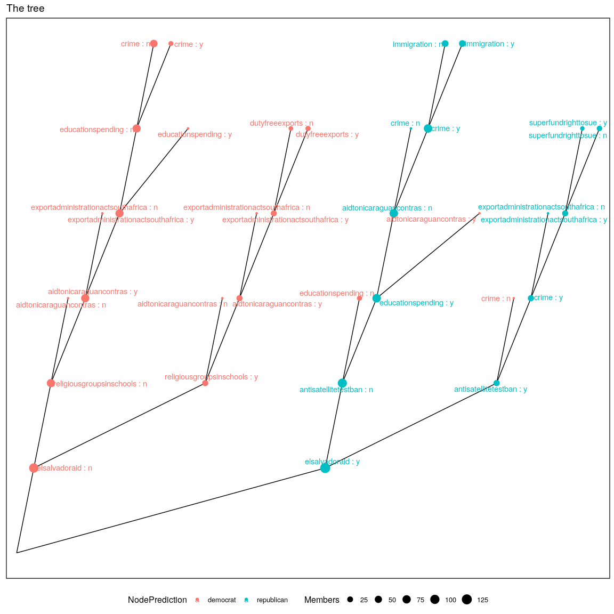
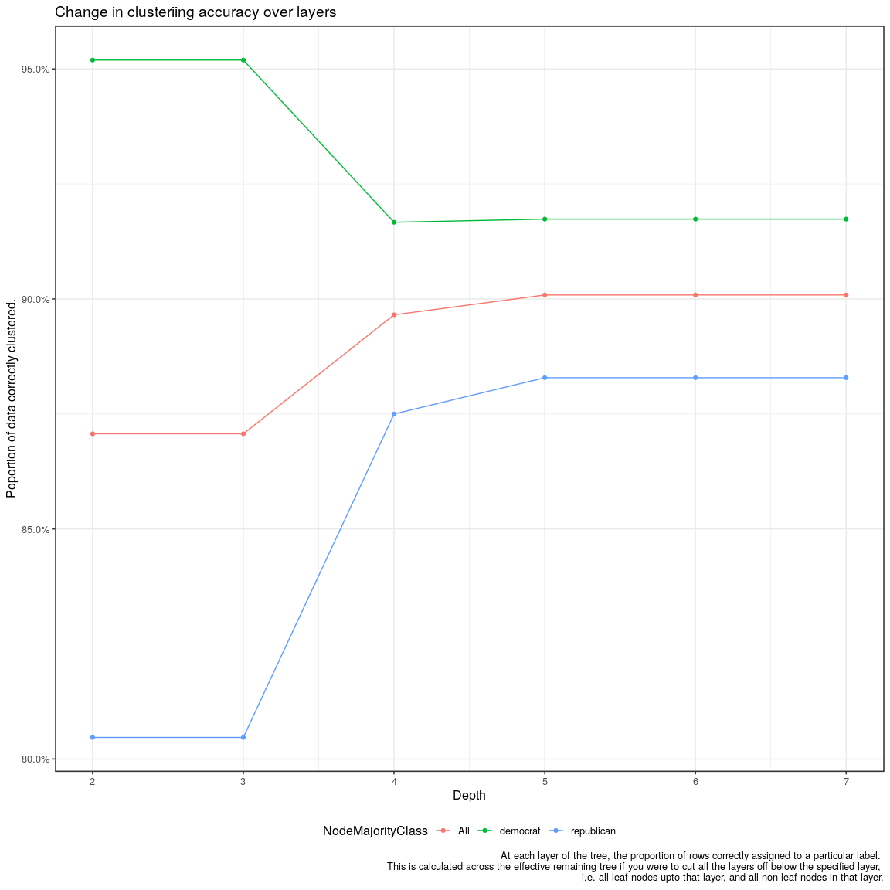
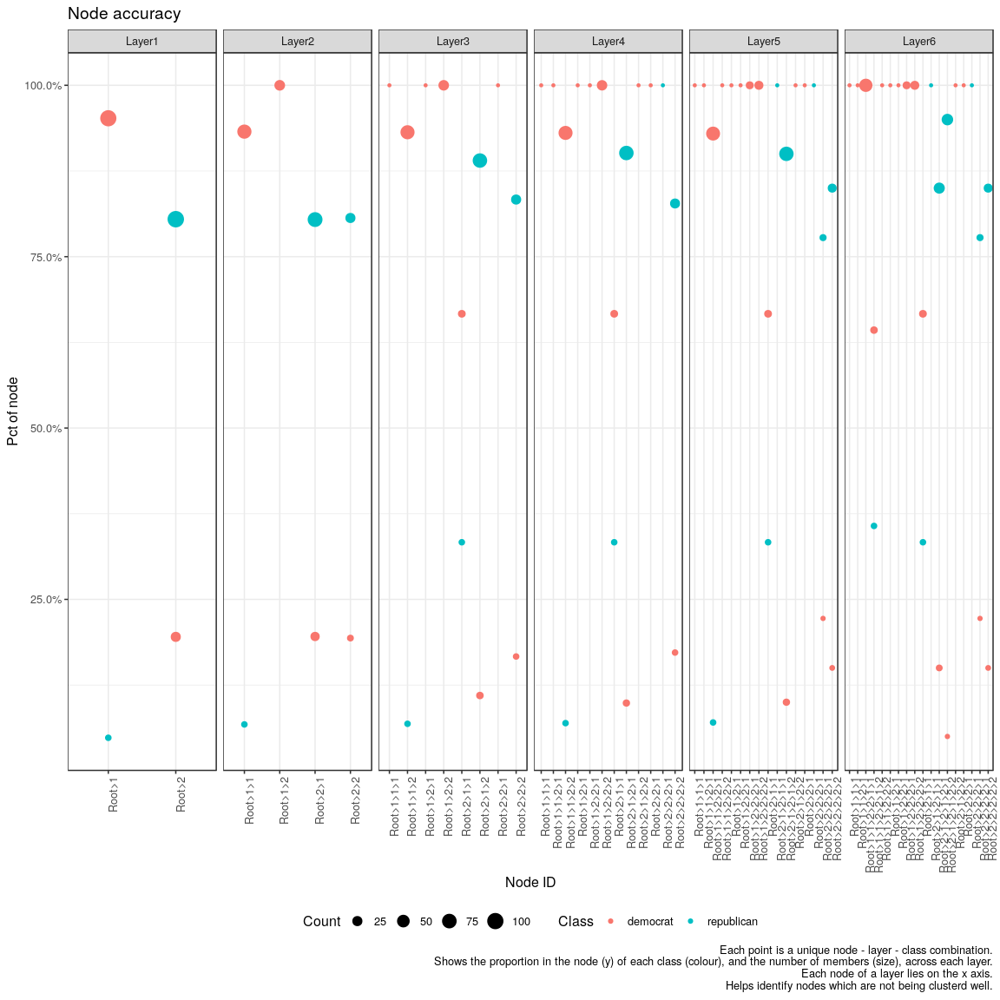
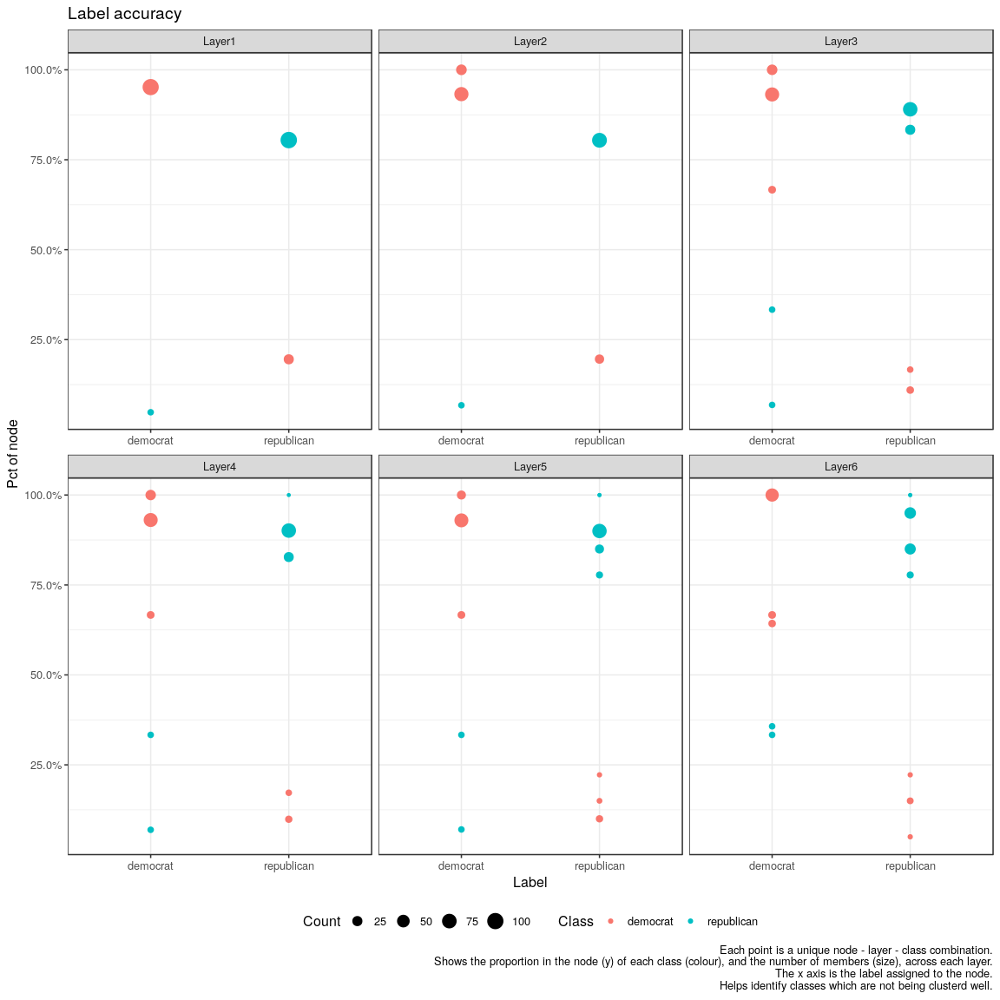
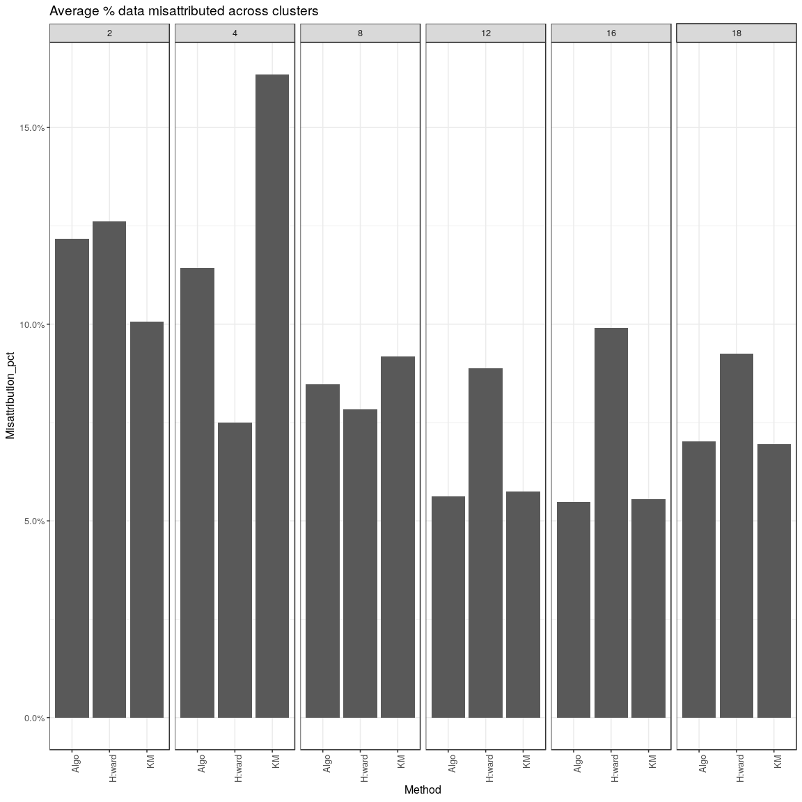
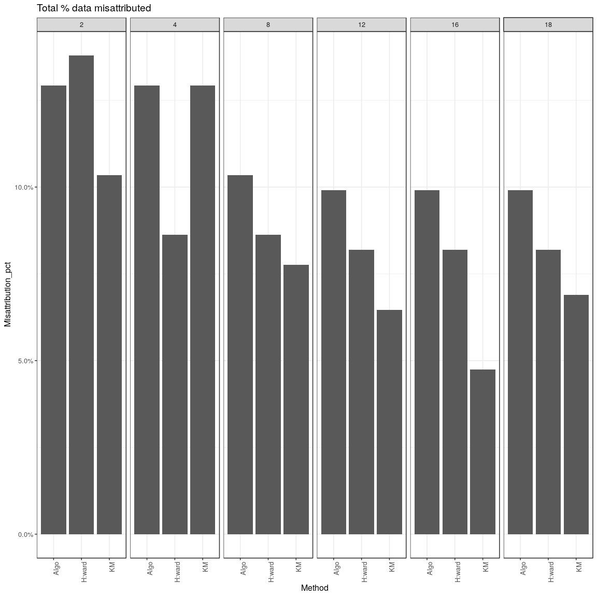
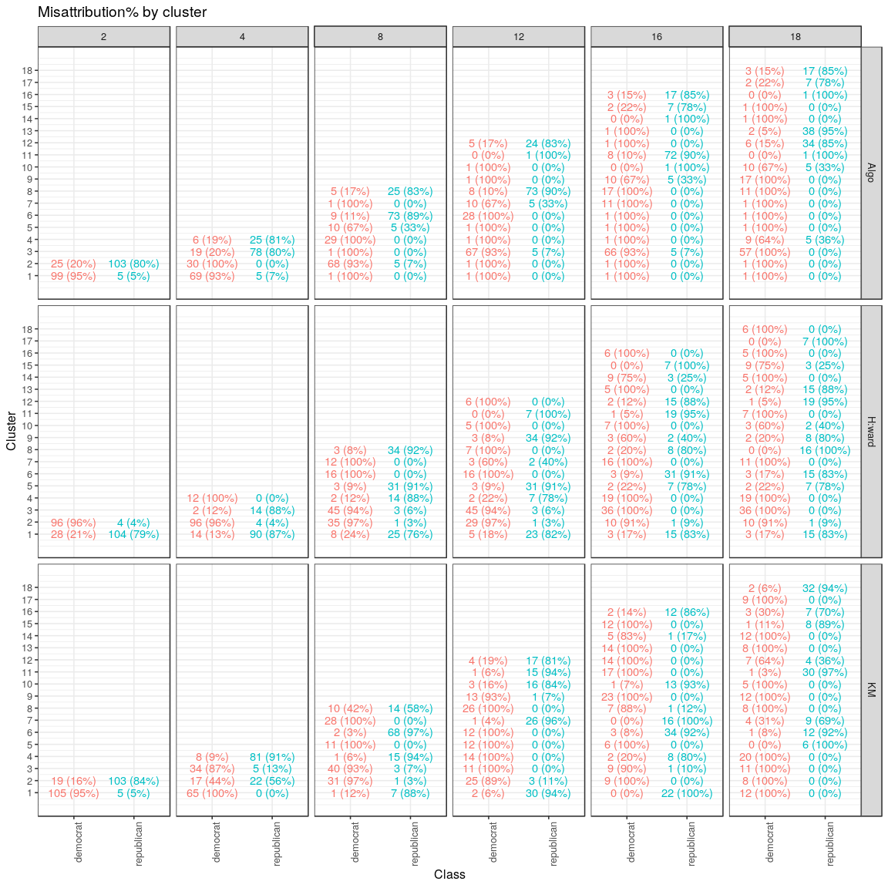
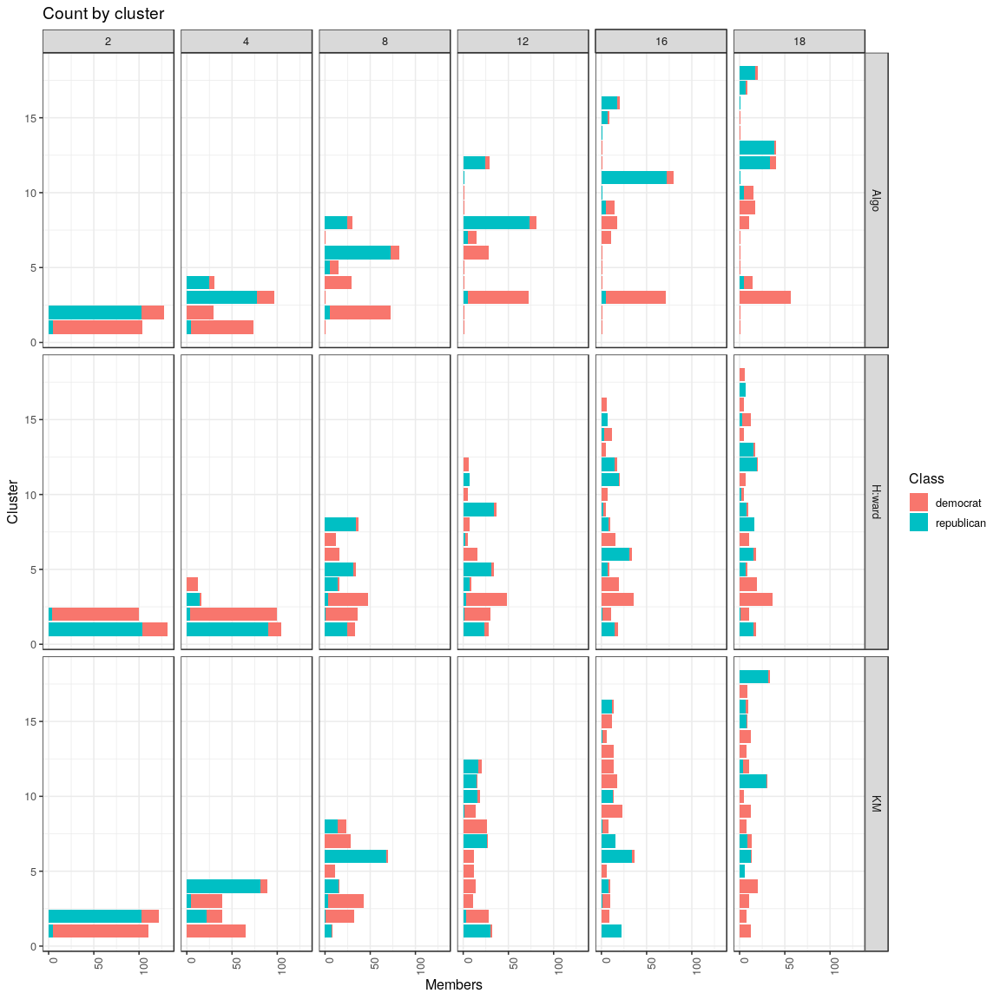

This document demoes the algorithm.

We will use the UCI voting dataset. ( Add reference. )

There is some pre-processing that needs to happen on the data. This
should be handled within the algorithm's code but for now it's
separately listed outside.

The clustering algo can be run on this dataset using the function
`RecursivePartitioningTreeClustering`.

Model details
=============

Using the `AssignCluster` function, we can predict the clustering
assignment for each observation in the dataset.

There are various other functions to help us analyse the results
further. These functions are needed only on such demonstrations since on
actual problems we won't have access to the actual labels of the
dataset.

Performance on other algorithms
===============================

We will compare the algorithm with hierarchical cluster by Ward method
and K-means.

Elaborate on the details.

